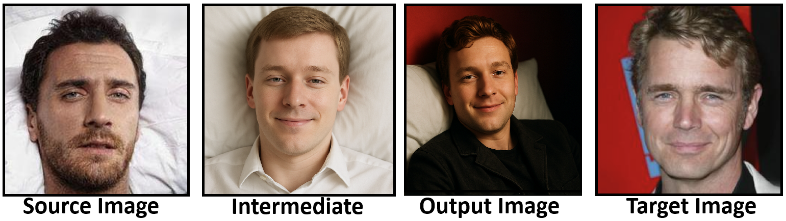
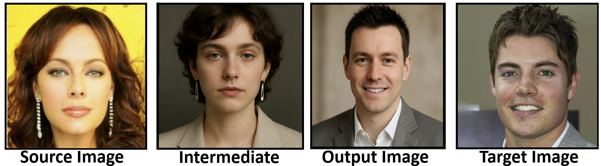
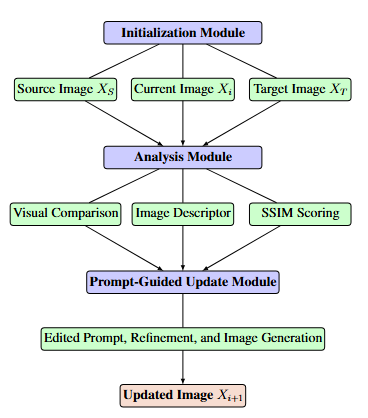
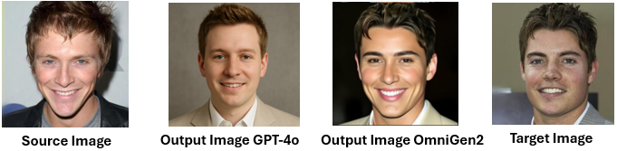

# PHANTOM: Prompt-based Human Attribute Navigation for Targeted Obfuscation with Multimodal Large Language Models
This repository contains the codebase for the manuscript titled **"PHANTOM: Prompt-based Human Attribute Navigation for Targeted Obfuscation with Multimodal Large Language Models."**

In this framework, we consider an attacker image (referred to as the *source image* in the manuscript) and a victim image (the *target image* in the manuscript). The purpose of PHANTOM is to generate an intermediate image that an attacker can use to effectively impersonate the victim by systematically modifying human attributes guided by multimodal large language models.

<div style="text-align: center;">

  <figure style="
      display: inline-block;
      width: 45%;
      margin: 0 1em;
      vertical-align: top;
      text-align: center;  
  ">
    
    <figcaption style="font-style: italic; margin-top: 0.5em;">
      (a) Impersonation within the same gender
    </figcaption>
  </figure>

  <figure style="
      display: inline-block;
      width: 45%;
      margin: 0 1em;
      vertical-align: top;
      text-align: center;  
  ">
    
    <figcaption style="font-style: italic; margin-top: 0.5em;">
      (b) Impersonation with different genders
    </figcaption>
  </figure>

</div>

<p align="center" style="font-style: bold;">
  Figure 1. PHANTOM-generated impersonation attacks in same-gender (a) and different-gender (b) scenarios.
</p>

# Flowchart of PHANTOM

PHANTOM is operated through the following sequence of integrated modules:

- **Initialization Module:** Each iteration in PHANTOM begins with the current updated image, along with the fixed source and target images.

- **Analysis Module:** Next, PHANTOM compares the source and target images using the LLM, identifying key visual differences (e.g., facial structure, hairstyle, skin tone, background) and translating them into precise editing instructions. It also evaluates how each change affects SSIM to prioritize edits that better align the source with the target.

- **Prompt-Guided Update Module:** At this module, the LLM generates an updated image based on the latest edit instructions. PHANTOM then evaluates its SSIM, and if the result satisfies the imposed constraints, the image is accepted for the next editing round.

We will show the flowchart below.

<p align="center">
  
</p>

<p align="center" style="font-style: bold;">
  Figure 2. A single iteration of the PHANTOM framework.
</p>

# Folder Structure

```
├── Codebase
│ ├── GPT4o
│ │ ├── config.py
│ │ └── image_utils.py
│ │ └── main.py
│ │ └── openai_services.py
│ └── select_llm.py
```

# Usage Instructions

To implement the methodology described, execute the following script with the specified number of iterations.

<p align="center">
  <code>python select_llm.py</code>
</p>

# Evaluation Metrics

## Structure-Aware Image Similarity (PSNR-SIG)

PSNR-SIG metric enhances traditional PSNR by incorporating structural information. Unlike classical PSNR, which may miss perceptually important differences, PSNR-SIG better reflects human perception by emphasizing structural fidelity. This makes it well-suited for PHANTOM, where preserving both global and local details is critical for realistic identity impersonation.

## LLM-Based Perceptual Similarity

Alongside PSNR-SIG, we use state-of-the-art LLMs: GPT-4o, Claude 3.7 Sonnet, and Gemini 2.5 Flash, to assess perceptual similarity. Each model is prompted with a standardized query to rate similarity between SOURCE and OUTPUT images and TARGET and OUTPUT images on a [0, 1] scale.

# Main Results

## PSNR-SIG Performance Analysis

<div align="center">

**Table:** Mean PSNR-SIG similarity scores between source–target, output–target, and output–source image pairs for each experimental setting. <span style="color:green;">↑</span> marks a substantial increase in similarity, whereas <span style="color:gray;">↓</span> marks only a modest reduction.

| **Setting**     | **Src–Tgt** | **Out–Tgt**       | **Out–Src**       |
|-----------------|:-----------:|:-----------------:|:-----------------:|
| Within-Group    |     0.27    |  0.93 <span style="color:green;">↑</span> | 0.89 <span style="color:gray;">↓</span> |
| Across-Gender   |     0.27    |  0.93 <span style="color:green;">↑</span> | 0.90 <span style="color:gray;">↓</span> |
| Across-Race     |     0.25    |  0.93 <span style="color:green;">↑</span> | 0.89 <span style="color:gray;">↓</span> |

</div>

## LLM-Based Similarity Evaluation

<div align="center">

<b>Table:</b> LLM-based similarity between each source–target (Src–Tgt) and output–target (Out–Tgt) pair. The symbol <span style="color:green;">↑</span> marks the increase achieved after applying the PHANTOM framework.

<table>
<thead>
<tr>
  <th rowspan="2">Setting</th>
  <th colspan="2">GPT-4o</th>
  <th colspan="2">Claude 3.7 Sonnet</th>
  <th colspan="2">Gemini 2.5 Flash</th>
</tr>
<tr>
  <th>Src–Tgt</th><th>Out–Tgt</th>
  <th>Src–Tgt</th><th>Out–Tgt</th>
  <th>Src–Tgt</th><th>Out–Tgt</th>
</tr>
</thead>
<tbody align="center">
<tr>
  <td>Within-Group</td>
  <td>0.04</td><td>0.32 <span style="color:green;">↑</span></td>
  <td>0.15</td><td>0.58 <span style="color:green;">↑</span></td>
  <td>0.12</td><td>0.46 <span style="color:green;">↑</span></td>
</tr>
<tr>
  <td>Across-Gender</td>
  <td>0.00</td><td>0.28 <span style="color:green;">↑</span></td>
  <td>0.08</td><td>0.57 <span style="color:green;">↑</span></td>
  <td>0.04</td><td>0.38 <span style="color:green;">↑</span></td>
</tr>
<tr>
  <td>Across-Race</td>
  <td>0.01</td><td>0.20 <span style="color:green;">↑</span></td>
  <td>0.11</td><td>0.48 <span style="color:green;">↑</span></td>
  <td>0.05</td><td>0.39 <span style="color:green;">↑</span></td>
</tr>
</tbody>
</table>

</div>

## OmniGen2 vs GPT-4o?

After deriving the optimized edit prompt with the PHANTOM framework, we initially combined this prompt with the source and target images and submitted the trio to GPT-4o to obtain an edited result. Because GPT-4o is a proprietary, API-restricted model, we next sought an open-source alternative and selected OmniGen2. Visually, the edited image retains the high-level semantic structure of the target, similar to the GPT-4o result, while precisely implementing the specified modifications, as can be seen from the Figure below.

<p align="center">
  
</p>

<p align="center" style="font-style: bold;">
  Figure 3. Comparison of PHANTOM-optimized edits using the same prompt: from left to right, source image, GPT-4o edited output, OmniGen2 edited output, and target image.
</p>

To ensure that these edits not only convey the correct content but also exhibit naturalistic texture and lighting, we proceed to evaluate their photorealism using objective image-quality metrics. Thus, we quantitatively assessed photorealism in our within-group setting by computing Naturalness Image Quality Evaluator (NIQE) scores per model. As can be seen from Table below, GPT-4o achieved a mean NIQE of $4.67$, indicating closer alignment with natural image statistics, while OmniGen2 produced a mean NIQE of $6.08$, reflecting modest smoothing of high-frequency details. Nonetheless, both models maintained comparable lighting consistency and color fidelity with no pronounced artifacts, supporting OmniGen2’s viability as an open-source substitute.
