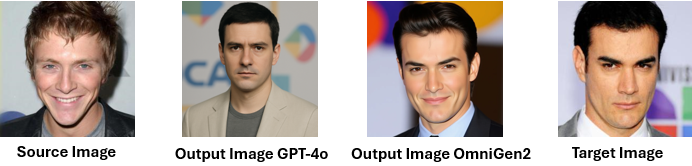
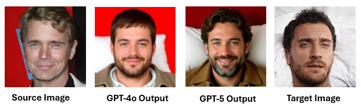

# PHANTOM: Prompt-based Human Attribute Navigation for Targeted Obfuscation with Multimodal Large Language Models
This repository contains the codebase for the manuscript titled **"PHANTOM: Prompt-based Human Attribute Navigation for Targeted Obfuscation with Multimodal Large Language Models."**

In this framework, we consider an attacker image (referred to as the *source image* in the manuscript) and a victim image (the *target image* in the manuscript). The goal of PHANTOM is to generate an intermediate image that enables the source to converge toward the target identity by systematically modifying human attributes under the guidance of multimodal large language models.

<div style="text-align: center;">

  <figure style="
    display: inline-block;
    width: 45%;
    margin: 0 1em;
    vertical-align: top;
  ">
    
    <figcaption style="font-style: italic; margin-top: 0.5em; text-align: center;">
      (a) Transformation within the same gender
    </figcaption>
  </figure>

  <figure style="
    display: inline-block;
    width: 45%;
    margin: 0 1em;
    vertical-align: top;
  ">
    
    <figcaption style="font-style: italic; margin-top: 0.5em; text-align: center;">
      (b) Transformation with different genders
    </figcaption>
  </figure>

</div>
<p align="center" style="font-style: bold;">
  Figure 1. PHANTOM-generated transformation attacks in same-gender (a) and different-gender (b) scenarios.
</p>

# Flowchart of PHANTOM

PHANTOM is operated through the following sequence of integrated modules:

- **Initialization Module:** Each iteration in PHANTOM begins with the current updated image, along with the fixed source and target images.

- **Analysis Module:** Next, PHANTOM compares the source and target images using the LLM, identifying key visual differences (e.g., facial structure, hairstyle, skin tone, background) and translating them into precise editing instructions. It also evaluates how each change affects FaceNet embedding distance (FND) to prioritize edits that better align the source with the target.

- **Prompt-Guided Update Module:** At this module, the LLM generates an updated image based on the latest edit instructions. PHANTOM then evaluates its FND, and if the result satisfies the imposed constraints, the image is accepted for the next editing round.

We will show the flowchart below.

<p align="center">
  
</p>

<p align="center" style="font-style: bold;">
  Figure 2. A single iteration of the PHANTOM framework.
</p>

# Folder Structure

```
├── Codebase
│ ├── GPT4o
│ │ ├── config.py
│ │ └── image_utils.py
│ │ └── main.py
│ │ └── openai_services.py
│ └── select_llm.py
```

# Usage Instructions

To implement the methodology described, execute the following script with the specified number of iterations.

<p align="center">
  <code>python select_llm.py</code>
</p>

# Evaluation Metrics

## Structure-Aware Image Similarity (PSNR-SIG)

PSNR-SIG metric enhances traditional PSNR by incorporating structural information. Unlike classical PSNR, which may miss perceptually important differences, PSNR-SIG better reflects human perception by emphasizing structural fidelity. This makes it well-suited for PHANTOM, where preserving both global and local details is critical for realistic identity impersonation.

## LLM-Based Perceptual Similarity

Alongside PSNR-SIG, we use state-of-the-art LLMs: GPT-5, Claude 3.7 Sonnet, and Gemini 2.5 Flash, to assess perceptual similarity. Each model is prompted with a standardized query to rate similarity between SOURCE and OUTPUT images and TARGET and OUTPUT images on a [0, 1] scale.

# Main Results

## PSNR-SIG Performance Analysis

<div align="center">

**Table 1:** Mean PSNR-SIG similarity scores between source–target, output–target, and output–source image pairs for each experimental setting. <b><span style="color:green;">↑</span></b> marks a substantial increase in similarity, whereas <span style="color:green;">✔</span> indicates significant similarity.

| **Setting**     | **Src–Tgt** | **Out–Tgt**       | **Out–Src**       |
|-----------------|:-----------:|:-----------------:|:-----------------:|
| Within-Group    |     0.27    |  0.93 <b><span style="color:green;">↑</span></b> | 0.89 <span style="color:green;">✔</span> |
| Across-Gender   |     0.27    |  0.93 <b><span style="color:green;">↑</span></b> | 0.90 <span style="color:green;">✔</span> |
| Across-Race     |     0.25    |  0.93 <b><span style="color:green;">↑</span></b> | 0.89 <span style="color:green;">✔</span> |

</div>

## LLM-Based Similarity Evaluation

<div align="center">

<b>Table 2:</b> LLM-based similarity between each source–target (Src–Tgt) and output–target (Out–Tgt) pair. The symbol <span style="color:green;">↑</span> marks the increase achieved after applying the PHANTOM framework.

<table>
<thead>
<tr>
  <th rowspan="2">Setting</th>
  <th colspan="2">GPT-5</th>
  <th colspan="2">Claude 3.7 Sonnet</th>
  <th colspan="2">Gemini 2.5 Flash</th>
</tr>
<tr>
  <th>Src–Tgt</th><th>Out–Tgt</th>
  <th>Src–Tgt</th><th>Out–Tgt</th>
  <th>Src–Tgt</th><th>Out–Tgt</th>
</tr>
</thead>
<tbody align="center">
<tr>
  <td>Within-Group</td>
  <td>0.14</td><td>0.32 <span style="color:green;">↑</span></td>
  <td>0.15</td><td>0.58 <span style="color:green;">↑</span></td>
  <td>0.12</td><td>0.46 <span style="color:green;">↑</span></td>
</tr>
<tr>
  <td>Across-Gender</td>
  <td>0.08</td><td>0.28 <span style="color:green;">↑</span></td>
  <td>0.08</td><td>0.57 <span style="color:green;">↑</span></td>
  <td>0.04</td><td>0.38 <span style="color:green;">↑</span></td>
</tr>
<tr>
  <td>Across-Race</td>
  <td>0.10</td><td>0.20 <span style="color:green;">↑</span></td>
  <td>0.11</td><td>0.48 <span style="color:green;">↑</span></td>
  <td>0.05</td><td>0.39 <span style="color:green;">↑</span></td>
</tr>
</tbody>
</table>

</div>

## OmniGen2 vs GPT-4o?

After deriving the optimized edit prompt with PHANTOM, we initially used GPT-4o to obtain an edited image from source and target inputs. Due to GPT-4o's proprietary nature, we later utilized OmniGen2, an open-source alternative. Both models effectively retained the semantic structure of the target while applying specified edits, as shown in Figure 3.

<p align="center">
  
</p>

<p align="center" style="font-weight: bold;">
  Figure 3. Comparison of PHANTOM-optimized edits using the same prompt: source image, GPT-4o output, OmniGen2 output, and target image (left to right). GPT-4o better captures the target image’s gravitas, while OmniGen2 struggles to preserve its emotional fidelity.
</p>

We quantitatively assessed photorealism using Naturalness Image Quality Evaluator (NIQE) scores in a within-group setting. GPT-4o achieved a mean NIQE score of 4.67, demonstrating superior alignment with natural image statistics, whereas OmniGen2 scored 6.02, indicating slight smoothing. Nonetheless, both maintained good lighting consistency and color fidelity, affirming OmniGen2 as a viable open-source alternative.

<div align="center">

**Table 3.** Mean NIQE scores for GPT-4o and OmniGen2, where lower scores indicate better photorealism.

| Setting      | GPT-4o | OmniGen2 |
|--------------|:------:|:--------:|
| Within-Group |  4.67  |   6.02   |

</div>


## Instruction Synthesis Study (GPT-4o vs GPT-5)

We perform a controlled component swap to assess whether the instruction generator inside the Analysis Module affects identity transfer when the editor is fixed. In the within-group setting, we fix the source and the target and hold all prompts and templates constant. At each iteration $(X_i, X_T)$ is provided to the Analysis Module, which uses an LLM to derive targeted edit instructions from the visual differences while adhering to the FND constraint so that the output moves toward the target without departing excessively from the source.

The Prompt-Guided Update Module applies these instructions using *OmniGen2* to generate the updated image. To isolate instruction synthesis effects, only the instruction source (GPT-4o vs. GPT-5) is varied, while the editor, decoding, and other settings remain fixed. Final image-target similarity is then assessed by two independent judges, Claude 3.7 Sonnet and Gemini 2.5 Flash, following the same protocol.

<p align="center">
  
</p>

<p align="center"><b>Figur 4:</b> Within-group comparison with <b>OmniGen2</b> fixed as the image generator. Columns (left to right): Source, GPT-4o output (FND = 0.54), GPT-5 output (FND = 0.37), Target. Initial source-to-target FND = 0.75.</p>

<p align="center"><b>Table 4:</b> Mean FND (with 95% confidence intervals) for the within-group setting. Lower values indicate better performance.</p>

<div align="center">

| Mean FND (Source–Target) | Mean FND (GPT-4o Output–Target) | Mean FND (GPT-5 Output–Target) |
|:------------------------:|:--------------------------------:|:-------------------------------:|
| 0.82 [0.77, 0.87]        | 0.63 [0.57, 0.66]                | 0.60 [0.55, 0.66]               |

</div>

<p align="center"><b>Table 5:</b> Within-group results (mean similarity with 95% confidence intervals) using OmniGen2 as the fixed image generator. Higher values indicate better performance.</p>

<div align="center">

<table>
<tr>
  <th>Chosen LLM</th>
  <th>Mean similarity (GPT-4o)</th>
  <th>Mean similarity (GPT-5)</th>
</tr>
<tr>
  <td>Claude 3.7 Sonnet</td>
  <td>0.46 [0.36, 0.57]</td>
  <td>0.51 [0.41, 0.61]</td>
</tr>
<tr>
  <td>Gemini 2.5 Flash</td>
  <td>0.56 [0.44, 0.69]</td>
  <td>0.58 [0.49, 0.68]</td>
</tr>
</table>

</div>
